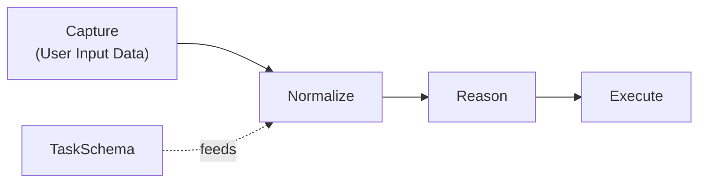
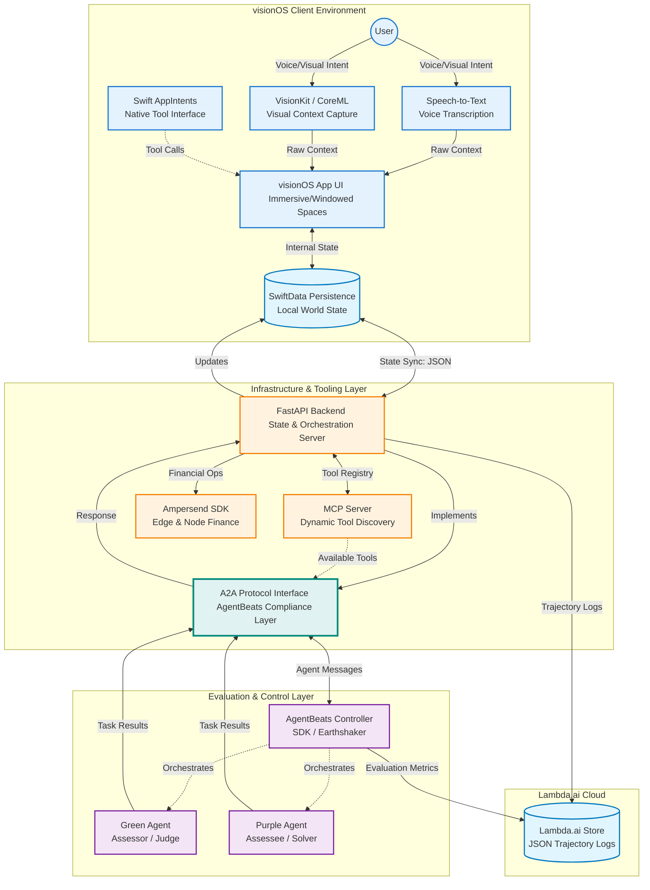

# CYRA AgentBeats Hackathon

## CYRA – AgentBeats Green Agent (Part 1)

### Evaluation Status (AgentBeats)

- CYRA is registered as a Green Agent on AgentBeats with a baseline Purple Agent.
- The leaderboard and evaluation pipeline are configured; evaluation runs will populate once final webhook provisioning completes.
- Docker image: `ghcr.io/erinjerri/cyra-green-agent:latest`

**TL;DR**

- **What:** A visionOS-native Green Agent benchmark for embodied, multimodal agent evaluation
- **How:** Deterministic Green referee + baseline Purple challenger, with full telemetry and reproducible scoring
- **Run:** `docker pull ghcr.io/erinjerri/cyra-green-agent:latest && docker run ghcr.io/erinjerri/cyra-green-agent:latest`
- **Demo:** [https://youtu.be/RiCsyp49Qn0](https://youtu.be/RiCsyp49Qn0)
- **AgentBeats Profile:** [https://agentbeats.dev/erinjerri/create-your-reality](https://agentbeats.dev/erinjerri/create-your-reality)

## Abstract

Create Your Reality Agent (CYRA) is a spatial-computing-native Green Agent benchmark built to evaluate embodied agent behavior in immersive AR/VR environments, following the design principles outlined in Establishing Best Practices for Building Rigorous Agentic Benchmarks (Zhu et al., 2025) and the AgentBeats Agentified Agent Assessment (AAA) framework.

Existing agent benchmarks such as OSWorld, WebArena, and τ-bench primarily evaluate agents through browser-based or API-centric tasks. CYRA extends this evaluation paradigm into spatial computing, measuring how agents perceive, reason, and act within 3D, multimodal interfaces while introducing spatial task competency as a first-class evaluation dimension.

CYRA is implemented initially on Apple Vision Pro (visionOS), combining:

- Swift-based spatial UI for immersive/Windowed spaces
- WebKit-constrained task scaffolds
- Speech-driven function calling for voice intent
- CoreML/VisionKit for visual context capture
- SwiftData/CoreData as the local persistent state layer
- Swift AppIntents as a native tool interface
- FastAPI as a backend bridge to coordinate state, telemetry, and A2A-compliant interactions with the AgentBeats platform

Structured task representations, agent actions, and full-trace telemetry are persisted via lambda.ai cloud storage, enabling reproducible replay, deterministic scoring, and post-hoc analysis. The system is designed with cross-platform abstractions, with Meta Quest devices supported in the second phase of the hackathon to enable Purple Agent evaluations beyond Vision Pro.

The hackathon proceeds in two phases:

- **Phase 1 — Green Agent**: CYRA evaluates productivity-focused workflows, such as task creation, task completion, document summarization, and spatial organization. The Green Agent acts as the environment manager, proctor, and evaluator, ensuring deterministic execution and reproducible scoring.
- **Phase 2 — Purple Agent**: A competing agent interacts with the Green Agent to execute finance-oriented or transactional workflows, including AP2-inspired simulated app purchases and structured reasoning tasks. This phase emphasizes cross-platform compatibility and A2A protocol interoperability.

Each benchmark run captures complete telemetry across:

- Speech input
- Vision/intent parsing
- Function-call sequences
- Spatial interactions
- Local and cloud state transitions

Evaluation is performed using state-matching rubrics comparing persisted app state, ledger entries, and task outcomes against explicit goal states. Metrics include task success rate, spatial accuracy, function-call correctness, latency, error recovery, and robustness across repeated trials.

CYRA, together with its complementary Purple Assessor Agent, forms a reusable, extensible benchmark template for evaluating agentic performance in embodied, multimodal, and cross-platform AR/VR environments. Developed under a rapid hackathon timeline, the project emphasizes transparency, modularity, and clearly documented limitations, while providing a foundation for future benchmarks in spatial computing and immersive AI systems.

## TL;DR - Description

CYRA is a visionOS-native agent evaluation framework designed for the AgentBeats Hackathon. The system pairs a deterministic "green agent" referee with a purpose-built "purple agent" challenger to stress-test the AgentBeats judging rubric through verifiable multi-modal evaluations.

**Key Features:**

- Vision-native sensing: visionOS client streams speech, vision, and SwiftData context into the FastAPI referee for synchronized multi-modal processing.
- FastAPI referee core: Backend endpoints orchestrate task dispatch, evaluation triggers, and JSON state persistence to keep traces auditable.
- Deterministic scoring: Green agent assessor enforces state matching plus action assertions to meet verifiable evaluation criteria.
- Purple agent stress test: Purpose-built purple agent probes A2A/MCP integrations while the green referee logs every scoring decision.
- Traceable judging trail: Trace logging bridges both agents so judges can replay tool calls, scores, and mismatches directly on AgentBeats.

## System Architecture

**TL;DR:**

- The app data flow



### Green Agent (Referee)

The green agent serves as the deterministic evaluation spine, validating visionOS streams, enforcing task rules, and logging traceable scores.

## System Design


### Mermaid.js diagram



**Green Agent Responsibilities:**

- **Sensing tier**: Speech-to-text, VisionKit/CoreML, and SwiftData surfaces feed a cohesive visionOS UI that captures operator intent and environment context
- **Control tier**: FastAPI routes /process and /tasks endpoints synchronize state, trigger evaluations, and persist JSON artifacts for auditability
- **Scoring tier**: State-matching plus action assertions convert observations into pass/fail decisions with explainable logs

**Flow:**

1. Capture multi-modal cues on visionOS and persist via SwiftData
2. Forward context to FastAPI for task orchestration and storage
3. Route triggers through the green assessor to verify state and actions
4. Emit evaluation verdicts back to the client and judging platform

In the AgentBeats framework, CYRA functions as the **Green Agent (assessor)**, while the Purple Agent represents a **baseline assessee** used to validate evaluation logic, A2A/MCP integration points, and reproducibility. The architecture is intentionally modular so that additional Purple Agents can be registered and assessed without changes to the Green Agent core.

### Purple Agent (Assessee)

The purple agent simulates the challenger agent that the green referee evaluates, exercising A2A/MCP integrations and providing stress-test scenarios.

**Purple Agent Responsibilities:**

- **Reasoning core**: Reasoning loop formulates plans, selects tools, and updates short-term memory to mimic real agent behavior
- **Tooling**: A2A/MCP tool calls stress-test platform integrations while feeding the judge with execution traces
- **Registry & scoring**: Agent registry registration and trace logging enable the green winner to score every interaction

**Flow:**

1. Kickoff script seeds the purple agent with evaluation objectives
2. Reasoning loop iterates, invoking tools through A2A/MCP layers
3. Interactions stream to the assessor for scoring and trace capture
4. Registry entry plus trace log closes the loop for judges

## Running the CYRA Green Agent

The CYRA Green Agent is packaged as a Docker container and can be run end-to-end without manual intervention.

### Pull and run the Docker image

#### Docker image

`ghcr.io/erinjerri/cyra-green-agent:latest`

```bash
docker pull ghcr.io/erinjerri/cyra-green-agent:latest
docker run ghcr.io/erinjerri/cyra-green-agent:latest
```

## Demo

A short demo video (≤3 minutes) showcasing the CYRA Green Agent end-to-end flow:

[https://youtu.be/RiCsyp49Qn0](https://youtu.be/RiCsyp49Qn0)

## Project Structure

```text
CYRA-AgentBeatsHackathon/
├── README.md              # judges read this
├── docs/
│   ├── architecture.md
│   ├── devlog.md          # setup, install, notes
│   ├── todo.md            # messy, evolving
│   └── evaluation.md
├── backend/
│   ├── main.py
│   ├── api/
│   ├── models/
│   └── Dockerfile
├── agents/
│   ├── green/
│   └── purple/
└── evaluation/
    ├── datasets/
    └── scripts/
```

Full tree snapshot: see `docs/dev-log.md`.

## Acknowledgments

- AgentBeats Hackathon organizers for the evaluation framework.
- Apple visionOS team for the platform and tools.
- OpenAI for the agent evaluation insights.
- Lambda.ai for the sponsored cloud storage

## Citation

If you use CYRA in your research, please cite:

```bibtex
@software{cyra_agentbeats_2025,
  title={CYRA: Vision-Native Agent Evaluation Framework for AgentBeats},
  author={Erin Jerri},
  year={2025},
  url={https://github.com/erinjerri/CYRA-AgentBeatsHackathon}
}
```