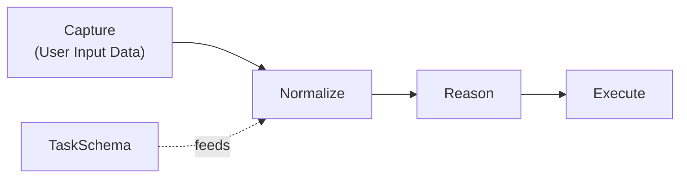
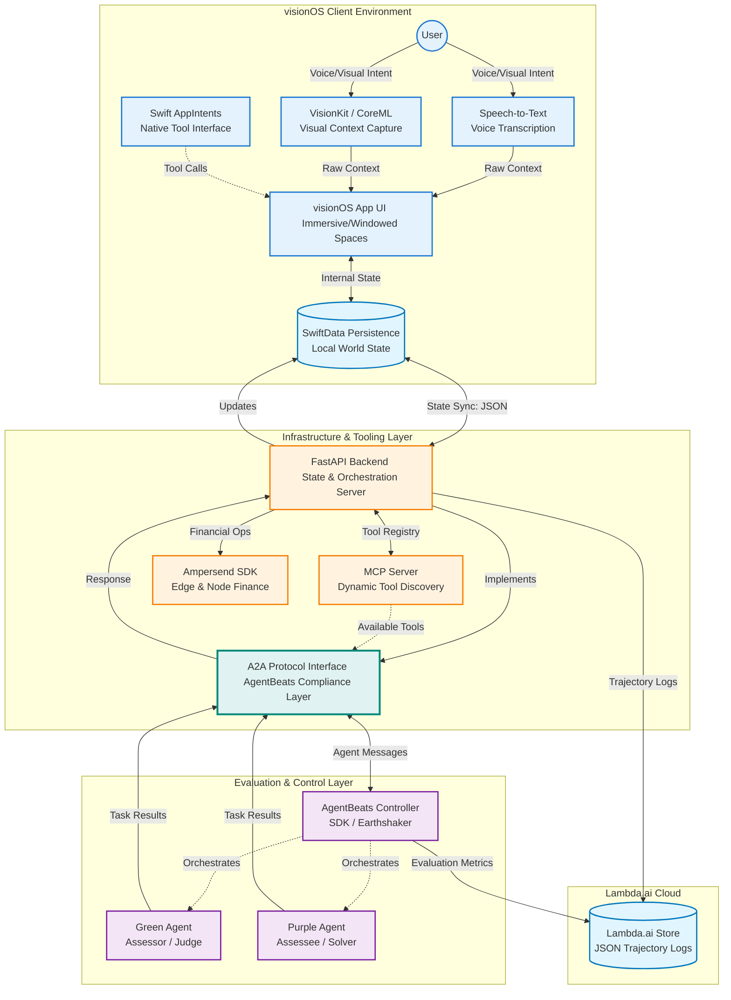

# CYRA AgentBeats Hackathon

## Abstract

Create Your Reality Agent (CYRA) is a spatial-computing-native Green Agent benchmark built to evaluate embodied agent behavior in immersive AR/VR environments, following the design principles outlined in Establishing Best Practices for Building Rigorous Agentic Benchmarks (Zhu et al., 2025) and the AgentBeats Agentified Agent Assessment (AAA) framework.

Existing agent benchmarks such as OSWorld, WebArena, and τ-bench primarily evaluate agents through browser-based or API-centric tasks. CYRA extends this evaluation paradigm into spatial computing, measuring how agents perceive, reason, and act within 3D, multimodal interfaces while introducing spatial task competency as a first-class evaluation dimension.

CYRA is implemented initially on Apple Vision Pro (visionOS), combining: • Swift-based spatial UI for immersive/Windowed spaces • WebKit-constrained task scaffolds • Speech-driven function calling for voice intent • CoreML/VisionKit for visual context capture • SwiftData/CoreData as the local persistent state layer • Swift AppIntents as a native tool interface • FastAPI as a backend bridge to coordinate state, telemetry, and A2A-compliant interactions with the AgentBeats platform

Structured task representations, agent actions, and full-trace telemetry are persisted via lambda.ai cloud storage, enabling reproducible replay, deterministic scoring, and post-hoc analysis. The system is designed with cross-platform abstractions, with Meta Quest devices supported in the second phase of the hackathon to enable Purple Agent evaluations beyond Vision Pro.

The hackathon proceeds in two phases: • Phase 1 — Green Agent: CYRA evaluates productivity-focused workflows, such as task creation, task completion, document summarization, and spatial organization. The Green Agent acts as the environment manager, proctor, and evaluator, ensuring deterministic execution and reproducible scoring. • Phase 2 — Purple Agent: A competing agent interacts with the Green Agent to execute finance-oriented or transactional workflows, including AP2-inspired simulated app purchases and structured reasoning tasks. This phase emphasizes cross-platform compatibility and A2A protocol interoperability.

Each benchmark run captures complete telemetry across: • Speech input • Vision/intent parsing • Function-call sequences • Spatial interactions • Local and cloud state transitions

Evaluation is performed using state-matching rubrics comparing persisted app state, ledger entries, and task outcomes against explicit goal states. Metrics include task success rate, spatial accuracy, function-call correctness, latency, error recovery, and robustness across repeated trials.

CYRA, together with its complementary Purple Assessor Agent, forms a reusable, extensible benchmark template for evaluating agentic performance in embodied, multimodal, and cross-platform AR/VR environments. Developed under a rapid hackathon timeline, the project emphasizes transparency, modularity, and clearly documented limitations, while providing a foundation for future benchmarks in spatial computing and immersive AI systems.

## tl;dr - Description

CYRA is a visionOS-native agent evaluation framework designed for the AgentBeats Hackathon. The system pairs a deterministic "green agent" referee with a purpose-built "purple agent" challenger to stress-test the AgentBeats judging rubric through verifiable multi-modal evaluations.

**Key Features:**

- Vision-native sensing: visionOS client streams speech, vision, and SwiftData context into the FastAPI referee for synchronized multi-modal processing.
- FastAPI referee core: Backend endpoints orchestrate task dispatch, evaluation triggers, and JSON state persistence to keep traces auditable.
- Deterministic scoring: Green agent assessor enforces state matching plus action assertions to meet verifiable evaluation criteria.
- Purple agent stress test: Purpose-built purple agent probes A2A/MCP integrations while the green referee logs every scoring decision.
- Traceable judging trail: Trace logging bridges both agents so judges can replay tool calls, scores, and mismatches directly on AgentBeats.

## System Architecture

tl;dr

- The app data flow



### Green Agent (Referee)

The green agent serves as the deterministic evaluation spine, validating visionOS streams, enforcing task rules, and logging traceable scores.

## System Design


### Mermaid.js diagram



**Green Agent Responsibilities:**

- **Sensing tier**: Speech-to-text, VisionKit/CoreML, and SwiftData surfaces feed a cohesive visionOS UI that captures operator intent and environment context
- **Control tier**: FastAPI routes /process and /tasks endpoints synchronize state, trigger evaluations, and persist JSON artifacts for auditability
- **Scoring tier**: State-matching plus action assertions convert observations into pass/fail decisions with explainable logs

**Flow:**

1. Capture multi-modal cues on visionOS and persist via SwiftData
2. Forward context to FastAPI for task orchestration and storage
3. Route triggers through the green assessor to verify state and actions
4. Emit evaluation verdicts back to the client and judging platform

### Purple Agent (Assessee)

The purple agent simulates the challenger agent that the green referee evaluates, exercising A2A/MCP integrations and providing stress-test scenarios.

**Purple Agent Responsibilities:**

- **Reasoning core**: Reasoning loop formulates plans, selects tools, and updates short-term memory to mimic real agent behavior
- **Tooling**: A2A/MCP tool calls stress-test platform integrations while feeding the judge with execution traces
- **Registry & scoring**: Agent registry registration and trace logging enable the green winner to score every interaction

**Flow:**

1. Kickoff script seeds the purple agent with evaluation objectives
2. Reasoning loop iterates, invoking tools through A2A/MCP layers
3. Interactions stream to the assessor for scoring and trace capture
4. Registry entry plus trace log closes the loop for judges

## Project Structure

```text
CYRA-AgentBeatsHackathon/
CYRA-AgentBeatsHackathon/
├── README.md
├── docs/
│   ├── architecture.md
│   ├── evaluation-rubric.md
│   └── api-reference.md
├── client/
│   ├── visionOS/
│   │   ├── AgentStateSyncService.swift        # NEW (MVP)
│   │   ├── TaskModel.swift                    # NEW (MVP)
│   │   ├── MainDashboardView.swift            # NEW (MVP)
│   │   ├── cyra_agentbeatsApp.swift           # UPDATED (MVP entry point)
│   │   ├── Assets.xcassets
│   │
│   │   # Template / Immersive files (kept for Part 2, not used in MVP)
│   │   ├── AppModel.swift
│   │   ├── ImmersiveView.swift
│   │   ├── SpeechManager.swift
│   │   ├── VisionManager.swift
│   │
│   │   # Deprecated / replaced files (kept for reference, not compiled)
│   │   ├── ContentView.swift
│   │   ├── SwiftDataModels.swift
│   │   └── SpatialAgentApp.swift
│   │
│   └── shared/
│       ├── Models.swift
│       └── Networking.swift
│
├── backend/
│   ├── app/
│   │   ├── main.py
│   │   ├── api/
│   │   │   ├── __init__.py
│   │   │   ├── process.py
│   │   │   ├── tasks.py
│   │   │   └── evaluate.py
│   │   ├── core/
│   │   │   ├── __init__.py
│   │   │   ├── assessor.py
│   │   │   ├── scoring.py
│   │   │   └── storage.py
│   │   └── models/
│   │       ├── __init__.py
│   │       ├── task.py
│   │       ├── evaluation.py
│   │       └── trace.py
│   ├── requirements.txt
│   └── Dockerfile
│
├── agents/
│   ├── green/
│   │   ├── __init__.py
│   │   ├── referee.py
│   │   ├── validators/
│   │   │   ├── __init__.py
│   │   │   ├── state_matcher.py
│   │   │   └── action_assertions.py
│   │   └── scoring/
│   │       ├── __init__.py
│   │       └── deterministic_scorer.py
│   └── purple/
│       ├── __init__.py
│       ├── challenger.py
│       ├── reasoning/
│       │   ├── __init__.py
│       │   ├── planner.py
│       │   └── memory.py
│       └── tools/
│           ├── __init__.py
│           ├── a2a_client.py
│           └── mcp_tools.py
│
├── evaluation/
│   ├── datasets/
│   │   ├── visionos_scenarios.json
│   │   └── task_definitions.json
│   ├── scripts/
│   │   ├── run_evaluation.py
│   │   └── generate_report.py
│   └── results/
│       └── .gitkeep
│
├── tests/
│   ├── unit/
│   │   ├── test_assessor.py
│   │   ├── test_scoring.py
│   │   └── test_agents.py
│   ├── integration/
│   │   ├── test_api.py
│   │   └── test_e2e.py
│   └── fixtures/
│       ├── sample_tasks.json
│       └── mock_traces.json
│
└── scripts/
    ├── setup.sh
    ├── run_locally.sh
    └── deploy.sh
```

## Installation

```bash
# Clone the repository
git clone https://github.com/erinjerri/CYRA-AgentBeatsHackathon.git
cd CYRA-AgentBeatsHackathon

# Setup backend
cd backend
python -m venv venv
source venv/bin/activate  # On Windows: venv\Scripts\activate
pip install -r requirements.txt

# Setup visionOS client (requires Xcode 15+ and visionOS simulator)
cd ../client/visionOS
open CYRA.xcodeproj
```

## Usage

### Running the Backend

```bash
cd backend
uvicorn app.main:app --reload --host 0.0.0.0 --port 8000
```

### Running the visionOS Client

1. Open `CYRA.xcodeproj` in Xcode
2. Select the visionOS simulator as target
3. Build and run (Cmd+R)

### Running Evaluations

```bash
cd evaluation
python scripts/run_evaluation.py --dataset visionos_scenarios.json
```

## Evaluation Rubric

The CYRA framework evaluates agents across these dimensions:

1. **State Matching Accuracy** - How well the agent state aligns with expected checkpoints
2. **Action Compliance** - Validity and safety of tool usage and timing
3. **Trace Completeness** - Quality and completeness of execution logs
4. **Multi-modal Integration** - Effective use of speech, vision, and context data
5. **Deterministic Scoring** - Consistency and verifiability of evaluation outcomes

## To-Do List

## 🟩 Part 1 — Green Agent Hackathon (Current Submission)

| Time / Part                                        | Task Description                                                                                                                                                                                                                                                                                                                                 | Done |
|----------------------------------------------------|----------------------------------------------------------------------------------------------------------------------------------------------------------------------------------------------------------------------------------------------------------------------------------------------------------------------------------------------------|------|
| Part 1                                  | Refactor architecture to match updated project tree. Define STT → Task creation and VisionKit/CoreML → Task creation. Update Mermaid diagrams to reflect A2A protocol + state matching. Set up local FastAPI backend with file telemetry store in JSON. Test endpoints with curl/Postman.                                                               |✅|
| Part 1                                             | Implement STT → Task creation pipeline in Swift. Implement VisionKit/CoreML → Task creation pipeline. Add OpenAI + Apple FM hooks for intent extraction. Test both flows locally.                                                                                                                                                                | ⏳ Tabled this and some immersive features |
| Part 1                                             | Create Docker file for AgentBeats registry. Deploy FastAPI backend to Lambda.ai. Install deps, run server. Connect Swift → backend (AgentStateSyncService.swift). Test end-to-end: speech/image → task JSON → backend → local state file.                                                                                                                                                    |✅|
| Part 1                                             | C Implement A2A protocol v1: Assessor simulates user; multi-round reasoning; prompts for daily task scenarios. Add `/evaluate` endpoint for state matching. Run sample benchmarks.                                                                                                                                                                 |      |
| Part 1                                             | Update README + `benchmark_design.md` with: A2A protocol; State matching; Action assertions; STT + CV multimodal flows. Commit/push.                                                                                                                                                                                                             |      |
| Part 1                                             | Implement rubrics: `state_matching.py`; `action_assertions.py`. Run multi-trial benchmarks for Green Agent.                                                                                                                                                                                                                                      |      |
| Part 1                                             | Spatial enhancements: `ImmersiveControlSpace.swift`; gesture/gaze stubs. Test on Vision Pro simulator.                                                                                                                                                                                                                                          |      |
| Part 1                                             | Finalize architecture diagrams + `system.mmd`. Update README with: A2A protocol; multimodal task creation; evaluation rubric.                                                                                                                                                                                                                    |      |
| Part 1          | Record 3‑min demo video: 1 min abstract + architecture; 1 min Green Agent demo (STT + CV task creation). Screen record Xcode simulator + backend logs.                                                                                                                                                                                           |      |
| Part 1             | Upload video to YouTube (unlisted). Add link to README + submission form.                                                                                                                                                                                                                                                                         |      |
| Part 1               | Fill hackathon form: Abstract; GitHub link; Video URL. Double-check requirements. Shut down instance.                                                                                                                                                                                                                                             |      |
| Jan 15, 4:00–11:59 PM                              | Buffer for last-minute fixes + final submission.                                                                                                                                                                                                                                                                                                  |      |

## To-Do List - Purple Agent (2nd half of hackathon)

## 🟪 Part 2 — Purple Agent (Post‑Hackathon Expansion)

### 🟣 Part 2 — Purple Agent (Architecture, A2A Pipeline, Multimodal Backlog, MongoDB, Pydantic)

| Component                                           | Task Description                                                                                                                                                                                                                                                                                                                                 | Done |
|-----------------------------------------------------|----------------------------------------------------------------------------------------------------------------------------------------------------------------------------------------------------------------------------------------------------------------------------------------------------------------------------------------------------|------|
| Purple Agent — Architecture                        | Define Purple Agent role: assessee agent competing against top Green Agents. Review A2A protocol requirements (input modes, output modes, tool-call structure). Identify which Green Agent tasks your Purple Agent must solve.                                                                                                                    | [ ]  |
| Purple Agent — Assessee Agent Impl                 | Implement Purple Agent as an A2A-compatible assessee agent. Add reasoning loop, memory, and tool-use stubs. Ensure compatibility with AgentBeats assessor agents.                                                                                                                                                                                  | [ ]  |
| Purple Agent — Assessor Agent Impl                 | Implement assessor agent for your chosen evaluation track. Add kickoff logic, scoring logic, and multi-step evaluation flow. Ensure it can run assessments end-to-end.                                                                                                                                                                             | [ ]  |
| Purple Agent — Kickoff Script                      | Build kickoff script to send initial message to assessor agent. Include task_config, environment selection, user strategy, and model provider. Validate that Purple Agent responds with READY.                                                                                                                                                     | [ ]  |
| Purple Agent — Tooling (MCP / A2A Tools)           | Add MCP tool definitions (if needed). Ensure Purple Agent can request tools via A2A-compliant `<tool>` and `<args>` tags. Validate tool-call correctness.                                                                                                                                                                                         | [ ]  |
| Purple Agent — Evaluation Metrics                  | Implement scoring: state matching, action correctness, multi-step reasoning quality, tool-use correctness. Align with AgentBeats rubric expectations (reproducible, deterministic, multi-level trace logging).                                                                                                                                     | [ ]  |
| Purple Agent — Reproducibility                     | Add auto-reset, deterministic seeds, and trace logging. Ensure assessments can be replayed. Package logs in `.eval_sessions` format.                                                                                                                                                                                                              | [ ]  |
| Purple Agent — Hosting & Deployment                | Package Purple Agent for hosting on AgentBeats platform. Add agent card TOML, expose via A2A server, ensure remote accessibility. Validate with A2A Inspector.                                                                                                                                                                                    | [ ]  |
| Purple Agent — Agent Registry Submission           | Prepare agent card metadata (name, description, capabilities, skills). Submit Purple Agent to AgentBeats Agent Registry. Validate that your agent appears in registry and can be discovered by assessor agents.                                                                                                                                     | [ ]  |
| Purple Agent — Integration Testing                 | Run full assessment: kickoff → assessee agent → assessor agent → scoring → trace logs. Validate multi-step reasoning, tool calls, and final metrics.                                                                                                                                                                                               | [ ]  |
| Purple Agent — Leaderboard Prep                    | Ensure your Purple Agent produces valid metrics for ranking. Test on hosted environment. Validate that your agent can compete on public leaderboard.                                                                                                                                                                                               | [ ]  |
| Purple Agent — Documentation                       | Update README with: Purple Agent architecture, A2A interface, MCP tools, evaluation rubric, reproducibility guarantees, hosting instructions, registry link.                                                                                                                                                                                       | [ ]  |
| Purple Agent — Final Submission                    | Prepare final submission: GitHub repo, agent card, hosted endpoint, registry link, demo video. Submit by Feb 22–23 deadline.                                                                                                                                                                                                                       | [ ]  |

<!-- Backlogged Multimodal Tasks (Part 1 tabled items) -->

| Component                                           | Task Description                                                                                                                                                                                                                                                                                                                                 | Done |
|-----------------------------------------------------|----------------------------------------------------------------------------------------------------------------------------------------------------------------------------------------------------------------------------------------------------------------------------------------------------------------------------------------------------|------|
| Multimodal — Speech-to-Text (Backlog)              | Implement STT → Task creation pipeline in Swift using Apple Speech framework or Foundation Models. Convert voice utterances into structured task JSON. Integrate with `/process` endpoint.                                                                                                                   | [ ]  |
| Multimodal — VisionKit Image Capture (Backlog)     | Implement VisionKit/CoreML image capture → Task creation pipeline. Extract task intent from captured images (receipts, objects, scenes). Send structured task JSON to `/process`.                                                                                                                           | [ ]  |
| Multimodal — Intent Extraction (Backlog)           | Add Apple Foundation Models or OpenAI models to convert STT text or image-derived text into structured task objects.                                                                                                                                                                                       | [ ]  |

<!-- MongoDB + Pydantic + A2A Structured Data -->

| Component                                           | Task Description                                                                                                                                                                                                                                                                                                                                 | Done |
|-----------------------------------------------------|----------------------------------------------------------------------------------------------------------------------------------------------------------------------------------------------------------------------------------------------------------------------------------------------------------------------------------------------------|------|
| Purple Agent — Data Layer Upgrade                  | Replace file-based task storage with MongoDB (Atlas or local).                                                                                                                                                                                                                                                                                     | [ ]  |
| Purple Agent — Pydantic Schemas                    | Create Pydantic `TaskSchema` and `EvaluationSchema` for typed validation.                                                                                                                                                                                                                                                                          | [ ]  |
| Purple Agent — FastAPI + Motor Integration         | Add Motor (async MongoDB driver) and integrate with FastAPI for async persistence.                                                                                                                                                                                                                                                                 | [ ]  |
| Purple Agent — Process Pipeline v2                 | Migrate `/process` to write validated tasks into MongoDB instead of JSON files.                                                                                                                                                                                                                                                                    | [ ]  |
| Purple Agent — Tasks API v2                        | Update `/tasks` to return typed Pydantic models from MongoDB queries.                                                                                                                                                                                                                                                                              | [ ]  |
| Purple Agent — A2A Schema Versioning               | Add versioned schemas for agent-to-agent communication (A2A).                                                                                                                                                                                                                                                                                      | [ ]  |
| Purple Agent — Reasoning Pipeline (Structured)     | Implement Purple Agent reasoning pipeline using structured task objects backed by Pydantic + MongoDB.                                                                                                                                                                                                                                              | [ ]  |
| Purple Agent — Swift Client Update (TaskModel v2)  | Update Swift client to consume typed responses (TaskModel v2) from MongoDB-backed API.                                                                                                                                                                                                                                                             | [ ]  |
| Purple Agent — Migration Script                    | Add migration script to convert existing JSON tasks → MongoDB documents.                                                                                                                                                                                                                                                                           | [ ]  |

## UPDATED TASKS AS OF 1/29/26

## Project Roadmap & Status

## Phase 1 To-Do List (Green Agent – Benchmark & Evaluator)

**Deadline: Jan 31, 2026 11:59 PM PT**
Focus: Fix blockers → A2A-compliant Dockerized Green Agent → Baseline Purple + leaderboard visibility (activity + results on agentbeats.dev profile) → Reproducible evals → Demo & Submit.

| Category              | Task Description                                                                 | Done |
|-----------------------|----------------------------------------------------------------------------------|------|
| Debugging             | Fix telemetry JSON logging in Vision Pro simulator: Task creation → populated JSON in backend/storage/telemetry/ (debug Xcode settings, SwiftData sync, FastAPI endpoint) | [ ]  |
| Cleanup / Scope       | Drop/defer non-MVP features: Remove Ampersend/finance integration, STT (Apple/Whisper), CV (VisionKit/OCR), MongoDB persistence; hardcode sample intents; update README with "Dropped for Phase 1 MVP" note | [ ]  |
| A2A Compliance        | Fork <https://github.com/RDI-Foundation/green-agent-template>; port FastAPI A2A logic (adapt messenger.py, executor.py, scoring/assessor patterns); integrate task creation eval stub; test local run (uv run src/server.py on port 9009) | [ ]  |
| Containerization      | Build & publish public Docker image from template (ghcr.io/erinjerri/cyra-green:latest); test docker run -p 9009:9009; enable public access in GHCR; standardize host (0.0.0.0) & Dockerfile | [ ]  |
| A2A Interface         | Ensure A2A protocol compliance: Implement standard message handling (task assignment, response submission, scoring) via ported template; add any missing /a2a endpoints if required | [ ]  |
| Baseline Purple       | Register baseline Purple agent: Use simple stub (echo/dummy responder from agent-template or tutorial example); build/push Docker (ghcr.io/erinjerri/cyra-baseline-purple:latest); register on agentbeats.dev as Purple type | [ ]  |
| Leaderboard Setup     | Create public leaderboard repo from <https://github.com/RDI-Foundation/agentbeats-leaderboard-template>; edit scenario.toml (Green + Purple IDs, domain=productivity, 3–5 tasks) | [ ]  |
| Webhook Integration   | Connect leaderboard repo to agent page: Edit <https://agentbeats.dev/erinjerri/create-your-reality> → add repo URL; paste DuckDB query; copy webhook URL; add webhook in repo Settings (Payload = webhook URL, JSON content type) | [ ]  |
| Reproducibility       | Run 1–2+ assessments: Push scenario.toml → GitHub Actions → merge PR with results JSON; repeat with minor config variation (e.g., num_tasks) to demonstrate reproducibility | [ ]  |
| Visibility Check      | Verify profile updates: Refresh agentbeats.dev page → confirm Leaderboards section appears + activity entries (e.g., "benchmarked [purple] (Results: abc123)") | [ ]  |
| Deterministic Scoring | Implement/verify automated backend scoring (metrics for task success, planning efficiency, intent accuracy) in ported template (integrate existing scoring.py if applicable) | [ ]  |
| Repro / Consistency   | Add DB/reset scripts or config for 100% run consistency (e.g., fixed seeds, sample tasks in datasets/) | [ ]  |
| Demo & Submission     | Record/edit 3-min demo video: Intro (30s), Vision Pro sim + telemetry JSON (1min), A2A/backend flow + profile screenshot with leaderboard/activity (1min), results/call to action (30s); upload YouTube unlisted | [ ]  |
| Submission Polish     | Finalize submission: Update Google form with GitHub link, Docker ref, video link, abstract ("VisionOS productivity task creation Green Agent benchmark via A2A"); polish README/LinkedIn draft; submit by deadline | [ ]  |

**Success Criteria for Phase 1**

- [ ] Docker image public & end-to-end runnable
- [ ] Baseline Purple registered
- [ ] Leaderboard repo connected + webhook active
- [ ] Profile shows Leaderboards + at least 1–2 benchmarked activity entries
- [ ] 2+ reproducible eval runs (merged PRs, consistent config)
- [ ] Video + abstract submitted

## Phase 2 Backlog (Purple Agent – Competing Agent) — Deadline: March 30, 2026

Deferred post-Phase 1. Expand later.

| Category              | Task Description                                                                 | Done |
|-----------------------|----------------------------------------------------------------------------------|------|
| Reasoning             | Structured multi-step planning with validated Pydantic task objects for complex tasks | [ ]  |
| Finance (Deferred)    | Spatial payments integration: Apple Pay (AP2) + Skyfire/Ampersend multi-agent protocols | [ ]  |
| UI/UX                 | Volumetric/immersive 3D dashboards & task creation volumes via RealityKit (VisionOS) | [ ]  |
| Sync                  | Apple ecosystem cross-device persistence (iCloud) + HealthKit biometric context | [ ]  |
| Multimodal (Deferred) | Re-enable Foundation STT + VisionKit capture for full physical object → task flow | [ ]  |
| Data Layer (Deferred) | Re-introduce MongoDB Atlas + Pydantic enforcement if needed for persistence | [ ]  |
| Leaderboard           | Performance tuning & optimization for public AgentX leaderboard scores | [ ]  |

## Contributing

1. Fork the repository
2. Create a feature branch (`git checkout -b feature/amazing-feature`)
3. Commit your changes (`git commit -m 'Add amazing feature'`)
4. Push to the branch (`git push origin feature/amazing-feature`)
5. Open a Pull Request

## License

This project is licensed under the MIT License - see the [LICENSE](LICENSE) file for details.

## Acknowledgments

- AgentBeats Hackathon organizers for the evaluation framework.
- Apple visionOS team for the platform and tools.
- OpenAI for the agent evaluation insights.
- Lambda.ai for the sponsored cloud storage

## Citation

If you use CYRA in your research, please cite:

```bibtex
@software{cyra_agentbeats_2025,
  title={CYRA: Vision-Native Agent Evaluation Framework for AgentBeats},
  author={Erin Jerri},
  year={2025},
  url={https://github.com/erinjerri/CYRA-AgentBeatsHackathon}
}
```

---

> [!NOTE]
> This README follows GitHub's best-practice recommendations for structure, clarity, and completeness. See [About READMEs](https://docs.github.com/en/repositories/managing-your-repositorys-settings-and-features/customizing-your-repository/about-readmes).
>